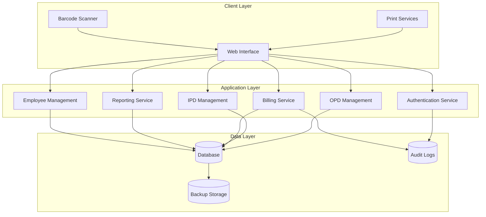

# Design Document: Hospital OPD-IPD Management System

## Overview

The Hospital OPD-IPD Management System is a comprehensive web-based application designed for real hospital operations in India. The system provides end-to-end management of outpatient and inpatient services, billing, investigations, procedures, operation theater management, employee management, and salary processing.

### Key Design Principles

- **Speed and Efficiency**: Optimized for reception desk operations with sub-2-second response times
- **Print-First Design**: Every transaction generates printable slips with barcodes
- **Role-Based Security**: Clear separation between Reception and Admin user capabilities
- **Error-Proof Billing**: No data loss tolerance with comprehensive audit trails
- **Indian Hospital Workflow**: Designed specifically for Indian hospital operational patterns

### Technology Stack

- **Frontend**: Modern web application with responsive design
- **Backend**: RESTful API architecture
- **Database**: Relational database with ACID compliance
- **Printing**: Support for both A4 and thermal printer formats
- **Barcode**: Standard barcode generation and scanning capabilities

## Architecture

### System Architecture



### Component Architecture

The system follows a modular architecture with clear separation of concerns:

1. **Authentication & Authorization Module**: Handles user login, role management, and access control
2. **Patient Management Module**: Manages patient registration, search, and history
3. **OPD Management Module**: Handles outpatient registrations and follow-ups
4. **IPD Management Module**: Manages inpatient admissions and bed allocation
5. **Billing Module**: Processes all charges, payments, and discharge bills
6. **Investigation Module**: Manages diagnostic tests and charges
7. **Procedure & Services Module**: Handles medical procedures and hospital services
8. **OT Management Module**: Manages operation theater charges and scheduling
9. **Employee Management Module**: Handles staff records and salary processing
10. **Reporting Module**: Generates various operational and financial reports
11. **Printing Module**: Handles slip generation and barcode printing
12. **Audit Module**: Maintains comprehensive audit trails

## Components and Interfaces

### Core Entities

#### Patient Entity
```
Patient {
  patient_id: String (Auto-generated, unique)
  name: String (required)
  age: Integer (required)
  gender: Enum [Male, Female, Other] (required)
  address: String (required)
  mobile_number: String (required, unique)
  created_date: DateTime
  updated_date: DateTime
}
```

#### Visit Entity
```
Visit {
  visit_id: String (Auto-generated, globally unique)
  patient_id: String (foreign key)
  visit_type: Enum [OPD_NEW, OPD_FOLLOWUP]
  doctor_id: String (foreign key)
  department: String
  serial_number: Integer (daily reset per doctor)
  visit_date: Date
  visit_time: Time
  opd_fee: Decimal
  payment_mode: Enum [CASH, UPI, CARD]
  status: Enum [ACTIVE, COMPLETED, CANCELLED]
}
```

#### IPD Entity
```
IPD {
  ipd_id: String (Auto-generated, unique)
  patient_id: String (foreign key)
  visit_id: String (foreign key, optional)
  admission_date: DateTime
  discharge_date: DateTime (nullable)
  file_charge: Decimal
  bed_id: String (foreign key)
  status: Enum [ADMITTED, DISCHARGED, TRANSFERRED]
}
```

#### Doctor Entity
```
Doctor {
  doctor_id: String (Auto-generated, unique)
  name: String (required)
  department: String (required)
  new_patient_fee: Decimal (required)
  followup_fee: Decimal (required)
  status: Enum [ACTIVE, INACTIVE]
  created_date: DateTime
}
```

#### Bed Entity
```
Bed {
  bed_id: String (Auto-generated, unique)
  bed_number: String (required)
  ward_type: Enum [GENERAL, SEMI_PRIVATE, PRIVATE]
  per_day_charge: Decimal (required)
  status: Enum [AVAILABLE, OCCUPIED, MAINTENANCE]
}
```

### Service Interfaces

#### Patient Service Interface
```
interface PatientService {
  registerNewPatient(patientData: PatientRegistrationRequest): PatientResponse
  searchPatients(searchCriteria: PatientSearchRequest): PatientSearchResponse
  getPatientHistory(patientId: String): PatientHistoryResponse
  updatePatientDetails(patientId: String, updateData: PatientUpdateRequest): PatientResponse
}
```

#### OPD Service Interface
```
interface OPDService {
  registerNewOPD(opdData: OPDRegistrationRequest): OPDResponse
  registerFollowUp(followUpData: FollowUpRequest): OPDResponse
  generateOPDSlip(visitId: String): SlipResponse
  getDailyOPDList(date: Date, doctorId?: String): OPDListResponse
}
```

#### Billing Service Interface
```
interface BillingService {
  addInvestigationCharges(visitId: String, investigations: InvestigationRequest[]): BillingResponse
  addProcedureCharges(visitId: String, procedures: ProcedureRequest[]): BillingResponse
  addServiceCharges(visitId: String, services: ServiceRequest[]): BillingResponse
  addManualCharges(visitId: String, charges: ManualChargeRequest[]): BillingResponse
  generateDischargeBill(ipdId: String): DischargeBillResponse
  processPayment(paymentData: PaymentRequest): PaymentResponse
}
```

#### Printing Service Interface
```
interface PrintingService {
  generateSlip(slipData: SlipRequest): SlipResponse
  generateBarcode(data: BarcodeData): BarcodeResponse
  printSlip(slipId: String, printerType: PrinterType): PrintResponse
  reprintSlip(slipId: String): PrintResponse
}
```

### API Endpoints

#### Authentication Endpoints
- `POST /api/auth/login` - User authentication
- `POST /api/auth/logout` - User logout
- `GET /api/auth/profile` - Get current user profile

#### Patient Management Endpoints
- `POST /api/patients` - Register new patient
- `GET /api/patients/search` - Search patients
- `GET /api/patients/{patientId}` - Get patient details
- `GET /api/patients/{patientId}/history` - Get patient history
- `PUT /api/patients/{patientId}` - Update patient details

#### OPD Management Endpoints
- `POST /api/opd/register` - Register new OPD patient
- `POST /api/opd/followup` - Register follow-up patient
- `GET /api/opd/daily-list` - Get daily OPD list
- `GET /api/opd/{visitId}/slip` - Generate OPD slip

#### IPD Management Endpoints
- `POST /api/ipd/admit` - Admit patient to IPD
- `PUT /api/ipd/{ipdId}/bed` - Change bed allocation
- `POST /api/ipd/{ipdId}/discharge` - Process discharge
- `GET /api/ipd/occupancy` - Get bed occupancy status

#### Billing Endpoints
- `POST /api/billing/{visitId}/investigations` - Add investigation charges
- `POST /api/billing/{visitId}/procedures` - Add procedure charges
- `POST /api/billing/{visitId}/services` - Add service charges
- `POST /api/billing/{visitId}/manual-charges` - Add manual charges
- `GET /api/billing/{ipdId}/discharge-bill` - Generate discharge bill
- `POST /api/billing/payment` - Process payment

## Data Models

### Database Schema

#### Patients Table
```sql
CREATE TABLE patients (
    patient_id VARCHAR(20) PRIMARY KEY,
    name VARCHAR(100) NOT NULL,
    age INTEGER NOT NULL,
    gender ENUM('MALE', 'FEMALE', 'OTHER') NOT NULL,
    address TEXT NOT NULL,
    mobile_number VARCHAR(15) NOT NULL UNIQUE,
    created_date TIMESTAMP DEFAULT CURRENT_TIMESTAMP,
    updated_date TIMESTAMP DEFAULT CURRENT_TIMESTAMP ON UPDATE CURRENT_TIMESTAMP
);
```

#### Doctors Table
```sql
CREATE TABLE doctors (
    doctor_id VARCHAR(20) PRIMARY KEY,
    name VARCHAR(100) NOT NULL,
    department VARCHAR(50) NOT NULL,
    new_patient_fee DECIMAL(10,2) NOT NULL,
    followup_fee DECIMAL(10,2) NOT NULL,
    status ENUM('ACTIVE', 'INACTIVE') DEFAULT 'ACTIVE',
    created_date TIMESTAMP DEFAULT CURRENT_TIMESTAMP
);
```

#### Visits Table
```sql
CREATE TABLE visits (
    visit_id VARCHAR(30) PRIMARY KEY,
    patient_id VARCHAR(20) NOT NULL,
    visit_type ENUM('OPD_NEW', 'OPD_FOLLOWUP') NOT NULL,
    doctor_id VARCHAR(20) NOT NULL,
    department VARCHAR(50) NOT NULL,
    serial_number INTEGER NOT NULL,
    visit_date DATE NOT NULL,
    visit_time TIME NOT NULL,
    opd_fee DECIMAL(10,2) NOT NULL,
    payment_mode ENUM('CASH', 'UPI', 'CARD') NOT NULL,
    status ENUM('ACTIVE', 'COMPLETED', 'CANCELLED') DEFAULT 'ACTIVE',
    created_date TIMESTAMP DEFAULT CURRENT_TIMESTAMP,
    FOREIGN KEY (patient_id) REFERENCES patients(patient_id),
    FOREIGN KEY (doctor_id) REFERENCES doctors(doctor_id)
);
```

#### IPD Table
```sql
CREATE TABLE ipd (
    ipd_id VARCHAR(20) PRIMARY KEY,
    patient_id VARCHAR(20) NOT NULL,
    visit_id VARCHAR(30),
    admission_date TIMESTAMP NOT NULL,
    discharge_date TIMESTAMP NULL,
    file_charge DECIMAL(10,2) NOT NULL,
    bed_id VARCHAR(20) NOT NULL,
    status ENUM('ADMITTED', 'DISCHARGED', 'TRANSFERRED') DEFAULT 'ADMITTED',
    created_date TIMESTAMP DEFAULT CURRENT_TIMESTAMP,
    FOREIGN KEY (patient_id) REFERENCES patients(patient_id),
    FOREIGN KEY (visit_id) REFERENCES visits(visit_id),
    FOREIGN KEY (bed_id) REFERENCES beds(bed_id)
);
```

#### Beds Table
```sql
CREATE TABLE beds (
    bed_id VARCHAR(20) PRIMARY KEY,
    bed_number VARCHAR(10) NOT NULL UNIQUE,
    ward_type ENUM('GENERAL', 'SEMI_PRIVATE', 'PRIVATE') NOT NULL,
    per_day_charge DECIMAL(10,2) NOT NULL,
    status ENUM('AVAILABLE', 'OCCUPIED', 'MAINTENANCE') DEFAULT 'AVAILABLE',
    created_date TIMESTAMP DEFAULT CURRENT_TIMESTAMP
);
```

#### Billing Charges Table
```sql
CREATE TABLE billing_charges (
    charge_id VARCHAR(30) PRIMARY KEY,
    visit_id VARCHAR(30),
    ipd_id VARCHAR(20),
    charge_type ENUM('INVESTIGATION', 'PROCEDURE', 'SERVICE', 'OT', 'MANUAL', 'BED') NOT NULL,
    charge_name VARCHAR(100) NOT NULL,
    quantity INTEGER DEFAULT 1,
    rate DECIMAL(10,2) NOT NULL,
    total_amount DECIMAL(10,2) NOT NULL,
    charge_date TIMESTAMP DEFAULT CURRENT_TIMESTAMP,
    created_by VARCHAR(20) NOT NULL,
    FOREIGN KEY (visit_id) REFERENCES visits(visit_id),
    FOREIGN KEY (ipd_id) REFERENCES ipd(ipd_id)
);
```

#### Employees Table
```sql
CREATE TABLE employees (
    employee_id VARCHAR(20) PRIMARY KEY,
    name VARCHAR(100) NOT NULL,
    post VARCHAR(50) NOT NULL,
    qualification VARCHAR(100),
    employment_status ENUM('PERMANENT', 'PROBATION') NOT NULL,
    duty_hours INTEGER NOT NULL,
    joining_date DATE NOT NULL,
    monthly_salary DECIMAL(10,2) NOT NULL,
    status ENUM('ACTIVE', 'INACTIVE') DEFAULT 'ACTIVE',
    created_date TIMESTAMP DEFAULT CURRENT_TIMESTAMP
);
```

#### Audit Logs Table
```sql
CREATE TABLE audit_logs (
    log_id VARCHAR(30) PRIMARY KEY,
    user_id VARCHAR(20) NOT NULL,
    action_type ENUM('MANUAL_CHARGE_ADD', 'MANUAL_CHARGE_EDIT', 'RATE_CHANGE') NOT NULL,
    table_name VARCHAR(50) NOT NULL,
    record_id VARCHAR(30) NOT NULL,
    old_value TEXT,
    new_value TEXT,
    timestamp TIMESTAMP DEFAULT CURRENT_TIMESTAMP
);
```

### Data Relationships

- **Patient → Visits**: One-to-Many (A patient can have multiple visits)
- **Patient → IPD**: One-to-Many (A patient can have multiple IPD admissions)
- **Visit → IPD**: One-to-One (A visit can be converted to one IPD admission)
- **Visit → Billing Charges**: One-to-Many (A visit can have multiple charges)
- **IPD → Billing Charges**: One-to-Many (An IPD admission can have multiple charges)
- **Doctor → Visits**: One-to-Many (A doctor can see multiple patients)
- **Bed → IPD**: One-to-Many (A bed can be used for multiple IPD admissions over time)

### Data Validation Rules

1. **Patient ID Generation**: Format "P" + YYYYMMDD + 4-digit sequence (e.g., P202401010001)
2. **Visit ID Generation**: Format "V" + YYYYMMDD + HHMMSS + 3-digit sequence (e.g., V20240101143001)
3. **IPD ID Generation**: Format "IPD" + YYYYMMDD + 4-digit sequence (e.g., IPD202401010001)
4. **Serial Number**: Daily reset per doctor, starting from 1
5. **Mobile Number**: 10-digit Indian mobile number format validation
6. **Payment Amounts**: Non-negative decimal values with 2 decimal places
7. **Date/Time**: All timestamps in IST (Indian Standard Time)
8. **Barcode Data**: Format "{PatientID}-{VisitID/IPDID}-{Timestamp}"
## Correctness Properties

*A property is a characteristic or behavior that should hold true across all valid executions of a system—essentially, a formal statement about what the system should do. Properties serve as the bridge between human-readable specifications and machine-verifiable correctness guarantees.*

### Property 1: Unique ID Generation
*For any* system operation that generates Patient_ID, Visit_ID, or IPD_ID, all generated IDs should be globally unique across the entire system
**Validates: Requirements 1.1, 1.10, 4.1**

### Property 2: Required Field Validation
*For any* data entry operation (patient registration, employee addition, doctor addition), all mandatory fields should be validated and empty/invalid fields should be rejected
**Validates: Requirements 1.2, 8.1, 16.1**

### Property 3: Role-Based Access Control
*For any* user attempting to access system functions, access should be granted only if the user's role has the required permissions for that specific function
**Validates: Requirements 3.2, 3.6, 9.1, 9.2, 9.4, 10.4, 14.4, 15.4, 16.4, 18.3**

### Property 4: Doctor-Department Consistency
*For any* doctor selection in OPD registration, the corresponding department should be automatically populated and match the doctor's assigned department
**Validates: Requirements 1.4**

### Property 5: Serial Number Daily Reset
*For any* doctor on any given date, serial numbers should start from 1 and increment sequentially, resetting to 1 on the next date
**Validates: Requirements 1.8**

### Property 6: Comprehensive Slip Content Validation
*For any* generated slip (OPD, Investigation, Procedure, Service, OT, Discharge), the slip should contain hospital header, patient details, relevant charges, barcode, and slip-specific information
**Validates: Requirements 1.6, 2.5, 3.5, 4.5, 5.4, 6.3, 10.2, 10.3, 17.1, 17.2, 17.3, 17.4, 17.5**

### Property 7: Charge Calculation Accuracy
*For any* billing operation (investigations, procedures, services, discharge), the total amount should equal the sum of all individual charges including manual charges and deductions
**Validates: Requirements 2.2, 3.4, 6.1, 6.2**

### Property 8: Data Linkage Integrity
*For any* charge entry (investigation, procedure, service, manual), the charge should be properly linked to either a valid Visit_ID or IPD_ID
**Validates: Requirements 2.4, 14.3**

### Property 9: Payment Mode Support
*For any* payment processing operation, the system should accept and process Cash, UPI, and Card payment modes correctly
**Validates: Requirements 1.5, 11.1**

### Property 10: Search Functionality Completeness
*For any* patient search operation, the system should return correct results when searching by Patient_ID, Mobile_Number, or Patient_Name
**Validates: Requirements 1.7, 13.1**

### Property 11: Barcode Content Validation
*For any* generated barcode, it should contain the correct Patient_ID and either Visit_ID or IPD_ID in the specified format
**Validates: Requirements 7.1**

### Property 12: Barcode-Record Mapping
*For any* scanned barcode, the system should open the correct patient record corresponding to the barcode data
**Validates: Requirements 7.2**

### Property 13: Bed Allocation Consistency
*For any* IPD admission, the allocated bed should be available and the bed status should be updated to occupied
**Validates: Requirements 4.3, 4.4**

### Property 14: Service Time Calculation
*For any* hourly service (bed, oxygen, nursing care), the calculated hours should equal the difference between end time and start time
**Validates: Requirements 3.4**

### Property 15: Discharge Bill Completeness
*For any* discharge bill generation, all applicable charges (OPD, IPD, investigations, procedures, services, OT, manual) should be included in the final bill
**Validates: Requirements 6.1**

### Property 16: Advance Payment Application
*For any* discharge bill with advance payments, the net payable amount should equal total charges minus advance payments
**Validates: Requirements 6.2, 11.3**

### Property 17: Data Integrity Preservation
*For any* system operation, no existing patient or billing data should be lost or corrupted during the operation
**Validates: Requirements 6.4, 11.4, 12.2, 19.3**

### Property 18: Audit Trail Completeness
*For any* manual charge addition or modification by Admin_User, a complete audit log entry should be created with user, timestamp, and change details
**Validates: Requirements 18.1, 18.2**

### Property 19: Patient History Completeness
*For any* patient record access, the displayed history should include all visits, charges, and services associated with that patient
**Validates: Requirements 13.2, 13.4**

### Property 20: Printer Format Support
*For any* slip printing operation, the system should successfully generate output for both A4 and thermal printer formats
**Validates: Requirements 10.1**

### Property 21: Payment Recording Immediacy
*For any* payment transaction, patient balances and payment history should be updated immediately upon successful payment processing
**Validates: Requirements 11.2**

### Property 22: Backup Creation Consistency
*For any* daily backup operation, all patient, billing, and system data should be included in the backup file
**Validates: Requirements 19.1**

### Property 23: Data Export Completeness
*For any* data export operation by Admin_User, all requested patient and billing data should be included in the export file
**Validates: Requirements 19.2**

### Property 24: System Recovery Integrity
*For any* data restoration operation, all restored data should match the original data from the backup file
**Validates: Requirements 19.4**

## Error Handling

### Error Categories

1. **Validation Errors**
   - Invalid patient data (missing required fields, invalid mobile numbers)
   - Invalid payment amounts (negative values, invalid decimal places)
   - Invalid date/time entries (future dates for past events)

2. **Business Logic Errors**
   - Attempting to admit patient to occupied bed
   - Trying to discharge patient with pending charges
   - Accessing functions without proper role permissions

3. **System Errors**
   - Database connection failures
   - Printer communication errors
   - Barcode generation failures

4. **Concurrency Errors**
   - Multiple users attempting to modify same record
   - Bed allocation conflicts
   - Serial number generation conflicts

### Error Handling Strategies

1. **Input Validation**
   - Client-side validation for immediate feedback
   - Server-side validation for security and data integrity
   - Clear error messages with specific field information

2. **Transaction Management**
   - Database transactions for multi-step operations
   - Rollback capabilities for failed operations
   - Atomic operations for critical billing functions

3. **Graceful Degradation**
   - Continue operations when non-critical services fail
   - Offline mode for essential functions during network issues
   - Manual override capabilities for system administrators

4. **Error Recovery**
   - Automatic retry mechanisms for transient failures
   - Data recovery procedures for system crashes
   - Backup and restore capabilities

### Error Response Format

```json
{
  "success": false,
  "error": {
    "code": "VALIDATION_ERROR",
    "message": "Patient mobile number is required",
    "field": "mobile_number",
    "timestamp": "2024-01-01T10:30:00Z"
  }
}
```

## Testing Strategy

### Dual Testing Approach

The Hospital Management System requires both unit testing and property-based testing to ensure comprehensive coverage:

**Unit Tests**: Focus on specific examples, edge cases, and error conditions
- Specific patient registration scenarios
- Integration points between modules
- Edge cases like leap year date handling
- Error conditions and exception handling

**Property Tests**: Verify universal properties across all inputs
- Universal properties that hold for all patients, visits, and charges
- Comprehensive input coverage through randomization
- Validation of business rules across all scenarios

### Property-Based Testing Configuration

**Testing Library**: Use QuickCheck (Haskell), Hypothesis (Python), or fast-check (JavaScript) depending on implementation language
**Test Configuration**: Minimum 100 iterations per property test
**Test Tagging**: Each property test must reference its design document property

Tag format: **Feature: hospital-management-system, Property {number}: {property_text}**

### Test Categories

1. **Data Validation Tests**
   - Property tests for ID uniqueness across large datasets
   - Unit tests for specific validation rules (mobile number format)
   - Edge cases for boundary conditions (maximum field lengths)

2. **Business Logic Tests**
   - Property tests for charge calculations across all service types
   - Unit tests for specific billing scenarios
   - Integration tests for OPD to IPD conversion workflow

3. **Access Control Tests**
   - Property tests for role-based access across all functions
   - Unit tests for specific permission scenarios
   - Security tests for unauthorized access attempts

4. **Data Integrity Tests**
   - Property tests for data preservation across operations
   - Unit tests for specific transaction scenarios
   - Concurrency tests for multi-user operations

5. **Printing and Barcode Tests**
   - Property tests for slip content validation across all types
   - Unit tests for specific printer formats
   - Integration tests for barcode scanning workflow

### Test Data Management

- **Synthetic Data Generation**: Create realistic test data for Indian hospital scenarios
- **Data Privacy**: Use anonymized data for testing, no real patient information
- **Test Database**: Separate test database with controlled data sets
- **Cleanup Procedures**: Automated cleanup of test data after test execution

### Performance Testing

- **Response Time Validation**: Ensure sub-2-second response times for normal operations
- **Load Testing**: Test system behavior with multiple concurrent users
- **Database Performance**: Validate query performance with large datasets
- **Printer Performance**: Test printing speed and reliability

### Integration Testing

- **End-to-End Workflows**: Test complete patient journey from registration to discharge
- **External System Integration**: Test barcode scanner and printer integration
- **Payment Gateway Integration**: Test online payment processing
- **Backup and Recovery**: Test backup creation and data restoration procedures